# Instrukcja tworzenia robota w UiPath Studio

## 1. Utworzenie nowego projektu

Otwórz UiPath Studio.

W sekcji **New Project** kliknij na **Process**.

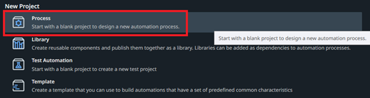

Nadaj nazwê projektu i opcjonalnie opis. Nastêpnie kliknij **Create**.

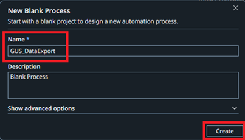

## 2. Dodanie sekwencji Use Application/Browser

Po pomyœlnym za³adowaniu projektu przejdŸ do sekcji **Activities** po lewej stronie i dodaj sekwencjê **Use Application/Browser**. Skorzystaj z wyszukiwarki pod ikon¹ lupki. Z³ap dan¹ sekwencjê i przeci¹gnij j¹ na canvas.

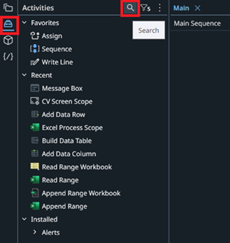
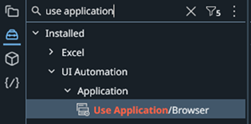

## 3. Wskazanie aplikacji do automatyzacji

Otwórz przegl¹darkê i przejdŸ na stronê: [https://stat.gov.pl/podstawowe-dane/](https://stat.gov.pl/podstawowe-dane/)

Wróæ do UiPath. Klikaj¹c na **Indicate application to automate** w dodanej sekwencji, zaznacz otwarte wczeœniej okno przegl¹darki klikaj¹c na zielony przycisk **Click to select browser**.

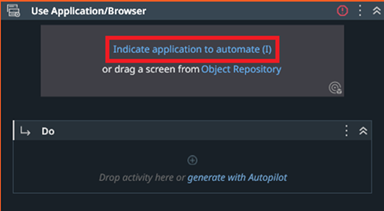
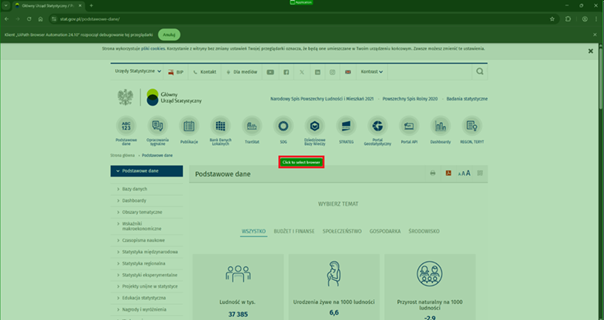

## 4. Ekstrakcja danych z tabeli

W sekcji **Do** naszej sekwencji bêdziemy dodawaæ kolejne kroki dzia³ania robota tzw. aktywnoœci. Pierwsz¹ aktywnoœci¹ bêdzie **Extract Table Data**. Wyszukaj nasz¹ aktywnoœæ w sekcji Activities i przeci¹gnij j¹ do sekcji Do.

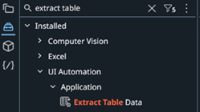
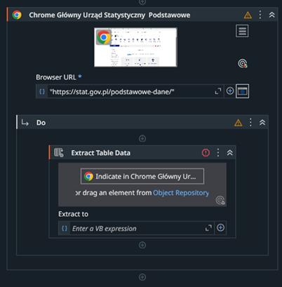

W dodanej aktywnoœci kliknij przycisk **Indicate in Chrome**.

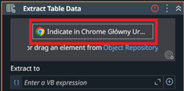

### 4.1. Konfiguracja ekstraktora tabeli

Otworzy siê kreator tworzenia tabeli w UiPath. W przegl¹darce na otwartej stronie GUS kliknij najpierw tytu³y poszczególnych kafelków.

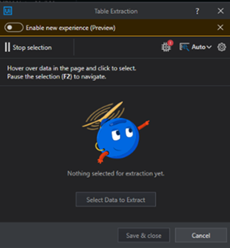
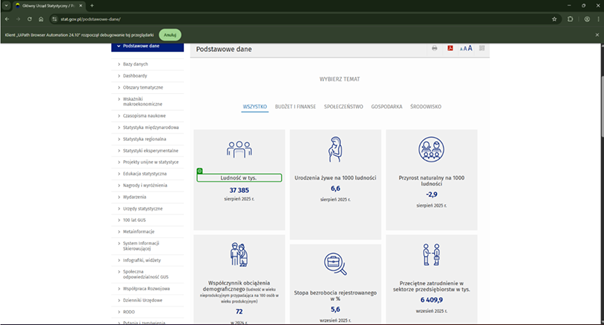

Zostan¹ zaznaczone wszystkie pasuj¹ce elementy. Kliknij przycisk **Confirm** w kreatorze ¿eby potwierdziæ wybór.


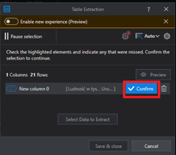

### 4.2. Dodanie drugiej kolumny

Nastêpnie do drugiej kolumny tabeli musimy dodaæ wartoœci liczbowe. Kliknij **Select Data to Extract**.

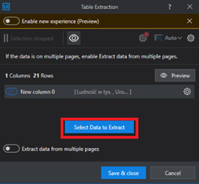

W przegl¹darce zaznacz pierwsz¹ wartoœæ liczbow¹ i zatwierdŸ.

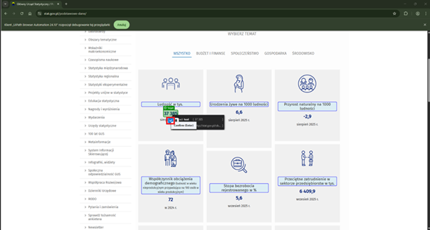

Zaznacz kolejn¹ wartoœæ liczbow¹. Wszystkie pozosta³e zostan¹ dodane automatycznie.


W kreatorze zatwierdŸ wybór przyciskiem **Confirm**.

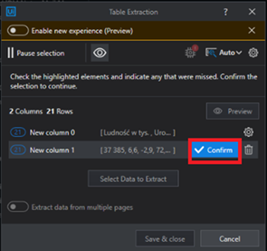

Zapisz tabelê przyciskiem **Save & Close**.

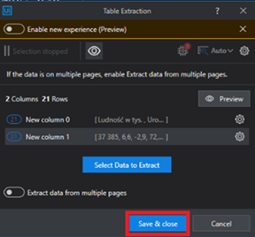

## 5. Utworzenie zmiennej dla wyekstraktowanych danych

W aktywnoœci kliknij pole **Extract to**. U¿yj skrótu klawiaturowego **Ctrl + K** ¿eby utworzyæ now¹ zmienn¹. Zapisz nazwê zmiennej `ExtractDataTable` i kliknij enter.

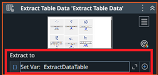

W dolnej czêœci okna w zak³adce **Data Manager** i **Variables** pojawi nam siê utworzona zmienna typu DataTable.

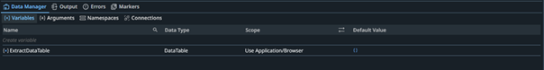

## 6. Przetwarzanie danych - wiersze z wynagrodzeniem

Dodaj aktywnoϾ **Assign** do przypisania zmiennej.

- W polu **To variable** u¿yj skrótu **Ctrl + K** i nadaj nazwê zmiennej `wynagrodzenieRow`
- W polu **Set value** wpisz wyra¿enie:
```vb
ExtractDataTable.AsEnumerable().Where(Function(row) row(0).ToString.ToLower.Contains("wynagrodzenie")).FirstOrDefault()
```

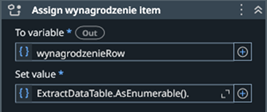

### 6.1. Zmiana typu zmiennej

UiPath automatycznie zapisa³ nasz¹ zmienn¹ jako typ String co powoduje b³¹d. W **DataManager - Variables** przy zmiennej `wynagrodzenieRow` kliknij typ String. Nastêpnie **Browse for Types...**

Wyszukaj typ **DataRow** i zatwierdŸ.

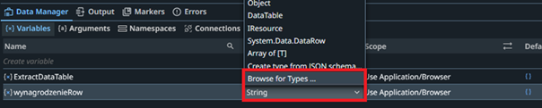


## 7. Utworzenie pozosta³ych zmiennych

Analogicznie dodaj kolejne zmienne:

### Zmienna: emeryturaRow
- **Typ:** DataRow
- **WartoϾ:**
```vb
ExtractDataTable.AsEnumerable().Where(Function(row) row(0).ToString.ToLower.Contains("emerytura")).FirstOrDefault()
```

### Zmienna: wynagrodzenieTitle
- **Typ:** String
- **WartoϾ:**
```vb
wynagrodzenieRow(0).ToString
```

### Zmienna: wynagrodzenieValue
- **Typ:** Double
- **WartoϾ:**
```vb
CDbl(wynagrodzenieRow(1).ToString.Replace(" ", "").Replace(",", "."))
```

### Zmienna: emeryturaTitle
- **Typ:** String
- **WartoϾ:**
```vb
emeryturaRow(0).ToString
```

### Zmienna: emeryturaValue
- **Typ:** Double
- **WartoϾ:**
```vb
CDbl(emeryturaRow(1).ToString.Replace(" ", "").Replace(",", "."))
```

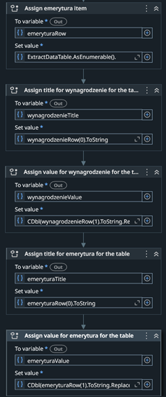

## 8. Budowa tabeli danych

Dodaj aktywnoϾ **Build Data Table**.

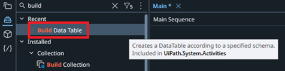

Kliknij przycisk **DataTable...** i ustaw tabelê jak poni¿ej:

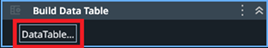
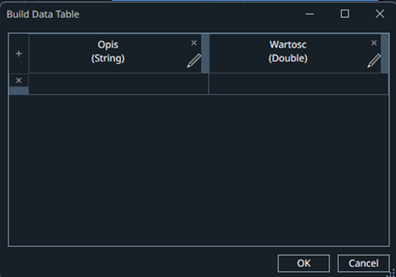

## 9. Dodanie wierszy do tabeli

### 9.1. Dane o wynagrodzeniu

Dodaj aktywnoϾ **Add Data Row**.

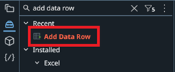

Uzupe³nij pola aktywnoœci jak poni¿ej:
- **ArrayRow:** `New Object() {wynagrodzenieTitle, wynagrodzenieValue}`
- **DataRow:** pozostaw puste
- **DataTable:** skorzystaj ze skrótu **Ctrl + K** i stwórz zmienn¹ `dataTable`

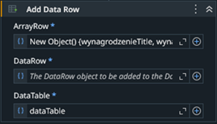

### 9.2. Dane o emeryturze

Dodaj kolejn¹ aktywnoœæ **Add Data Row**, tym razem dla wartoœci œredniej miesiêcznej emerytury.
- **ArrayRow:** `New Object() {emeryturaTitle, emeryturaValue}`
- **DataRow:** pozostaw puste
- **DataTable:** wpisz nazwê utworzonej wczeœniej zmiennej - `dataTable`

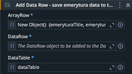

## 10. Zapis danych do pliku Excel

Dodaj aktywnoϾ **Write Range Workbook**.

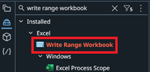

Uzupe³nij pola aktywnoœci jak poni¿ej:
- **Workbook path:** u¿yj skrótu **Ctrl + K** i stwórz zmienn¹ `filePath`
- **Sheet Name:** `"Arkusz1"`
- **Data table:** wpisz nazwê zmiennej - `dataTable`

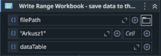

W zak³adce **Variables** do utworzonej zmiennej `filePath` zapisz œcie¿kê zapisu pliku np. `"C:\gus.xlsx"`.

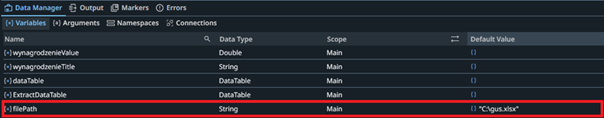

---

**Gratulacje!** Robot jest gotowy do uruchomienia i automatycznego pobierania danych ze strony GUS oraz zapisywania ich do pliku Excel.
"# uipath-robot-tutorial" 
